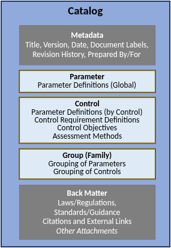

## `oscal-content-demo` OSCAL Catalogs 

## Table of Contents
- [Introduction](#introduction)
- [Features](#features)
  - [Usage](#usage)
- [Installation](#installation)
- [Usage](#usage)
  - [Basic Usage](#basic-usage)
  - [Advanced Usage](#advanced-advanced-usage)

---

## Introduction

> OSCAL Catalogs are part of the Control Layer 

The OSCAL Catalog model is described by NIST [here](https://pages.nist.gov/OSCAL/learn/concepts/layer/control/catalog/).

## Features

The OSCAL Catalogs are created by `complyscribe` and leverage `ComplianceAsCode/content` for machine-readable formatting of security content. 

### Usage

OSCAL Catalogs are used as a bank of content that can be used to further refine and tailor the scope for creation of OSCAL Profiles. 

## Installation _developers_

